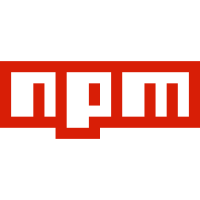

### Framework

- Vorpal  ⭐️(5117) Node's framework for interactive CLIs.
> The `cash` depend on this. Good Project to easy interactive...

### Command Line Arguments Parser

- yargs  Yargs be a node.js library fer hearties tryin' ter parse optstrings.

### Readline

- inquirer  A collection of common interactive command line user interfaces.
> `inquirer` is very good, support list, confirm, editor, etc.. input type

### Package Release

- np  ⭐️(4460) A better `npm publish`
